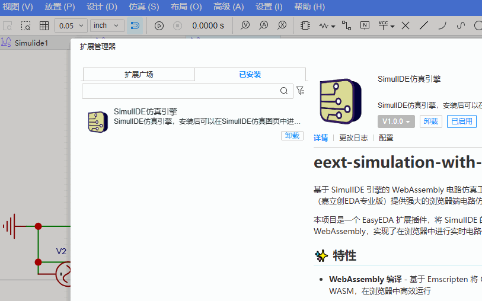

# eext-simulation-with-simulide

A WebAssembly-based circuit simulation tool powered by the SimulIDE engine, providing powerful browser-side circuit simulation for EasyEDA Pro (LCEDA Pro / JLCEDA Pro).

This project is an EasyEDA extension that compiles the SimulIDE C++ simulation engine to WebAssembly, enabling real-time circuit simulation directly in the browser.

## ✨ Features

- **WebAssembly Compilation** — Built with Emscripten to compile the C++ simulation engine to WASM, running efficiently in the browser

- **Real-time Simulation** — Event-driven simulation engine supporting real-time interaction and dynamic component property updates

- **Rich Component Library** — Supports BJTs, MOSFETs, diodes, resistors, inductors, logic gates, microcontrollers, and many more circuit elements

- **EasyEDA Extension** — Integrated as an extension plugin, communicating with the EasyEDA platform through standard APIs

- **Data Visualization** — JSON-formatted simulation data output, pushed to the EasyEDA UI in real time

- **High Performance** — Written in C++20 with O3 optimization, delivering near-native computational performance

- **Cross-platform** — Build and deploy on Windows, Linux, and macOS

- **Extensible** — Event-driven plugin architecture, easy to extend and maintain

### How the Extension Works

- **LCEDA Pro Platform**
  - **Extension Manager**
    - **simulation-with-simulide extension**
      - TypeScript extension code (`src/index.ts`)
      - Event listener registration
      - Simulation control logic
      - Data push handling
  - **WebAssembly module (WASM)**
    - C++ engine
    - Circuit simulation computation
    - Component state management

## Feature Demo



## 📦 Prerequisites

### Required Tools

| Tool         | Version    | Purpose                | Link                                              |
| ------------ | ---------- | ---------------------- | ------------------------------------------------- |
| CMake        | 3.15+      | Build configuration    | [cmake.org](https://cmake.org/)                   |
| Emscripten   | latest     | WASM compilation       | [emscripten.org](https://emscripten.org/)         |
| GCC          | 15.1.0+    | C++ compilation (local) | [MSYS2](https://www.msys2.org/)                 |
| Python       | 3.x        | Run test server        | [python.org](https://www.python.org/)             |

### Environment Setup

**Windows users (MSYS2 recommended):**

```bash
# After installing MSYS2, run in the MSYS2 terminal
pacman -S mingw-w64-x86_64-gcc mingw-w64-x86_64-cmake
```

**Install Emscripten:**

```bash
# Clone emsdk
git clone https://github.com/emscripten-core/emsdk.git
cd emsdk

# Install the latest version
./emsdk install latest
./emsdk activate latest

# Configure environment variables (run before each use)
source ./emsdk_env.sh   # Linux/macOS
# or
emsdk_env.bat           # Windows
```

## 🛠️ Build Steps

### 1. Configure EMSDK Path

Edit the build script and set the Emscripten SDK path:

**Linux/macOS:**

```bash
# Edit build-wasm.sh
export EMSDK="/path/to/your/emsdk"
```

**Windows:**

```batch
# Edit build-wasm.bat
set EMSDK=F:\Program Files (x86)\emsdk\emsdk
```

Common locations are auto-detected by the script. If detection fails, set the environment variable manually.

### 2. Run the Build

**Using the build script (recommended):**

```bash
# Linux/macOS
chmod +x build-wasm.sh
./build-wasm.sh

# Windows (MSYS2/Git Bash)
bash build-wasm.sh

# Windows (CMD)
build-wasm.bat
```

**Clean and rebuild:**

```bash
./build-wasm.sh clean
```

### 3. Build Output

After a successful build, the following files are generated in `output/`:

- `lceda-pro-sim-server.js` — JavaScript interface for the WASM module
- `lceda-pro-sim-server.wasm` — WebAssembly binary file

**Note:** To bundle the WASM files into the extension, copy both files into the root-level `wasm/` directory before running the extension packaging step.

### Manual Build (Advanced)

```bash
# Activate the Emscripten environment
source /path/to/emsdk/emsdk_env.sh
# On Windows (cmd), use emsdk_env.bat

# Create the build directory
mkdir -p build-wasm
cd build-wasm

# Configure CMake
emcmake cmake .. -G "Unix Makefiles" -DCMAKE_BUILD_TYPE=Release

# Build with parallel jobs
make -j$(nproc)
```

### TypeScript Extension Build

After the WASM build completes, build the TypeScript extension code:

```bash
# 1. Install dependencies
npm install

# 2. Full build (compile + package extension)
npm run build
```

**Build output:**

- `dist/index.js` — Compiled extension code
- `simulation-with-simulide_v1.0.0.eext` — Installable extension package

## 📦 Extension Packaging

The extension is packaged as a `.eext` file, installable via the LCEDA menu **Options → Advanced → Extension Manager**.

## 🛠️ Build Workflow

This project consists of two independent build flows:

1. **WASM Build** — Compile the C++ simulation engine to WebAssembly
2. **Extension Build** — Compile TypeScript and package into a `.eext` extension

## 🚀 Quick Start

### Using the Extension in EasyEDA

1. **Build the extension package**

   ```bash
   npm install
   npm run build
   ```

   This generates the file `simulation-with-simulide_v1.0.0.eext`.

2. **Install in EasyEDA**

   - Open EasyEDA Pro
   - Open the Extension Manager
   - Click "Install Extension"
   - Select the generated `.eext` file
   - Restart EasyEDA

3. **Use the extension**

   - Create a new simulation schematic in EDA
   - The extension is ready to use

### Local Development Testing

#### 1. Start the Local Test Server

After the build completes, use the Python server for testing:

```bash
# Option 1: Use the start-server script (Windows)
start-server.bat

# Option 2: Run Python directly
python serve.py

# Option 3: Use Python 3 (Linux/macOS)
python3 serve.py
```

The server starts at `http://localhost:8080`.

### 2. Test in the Browser

Open your browser and navigate to:

```
http://localhost:8080/test.html
```

### 3. Test Circuit Simulation

In the test page:

1. **Load a circuit file**
   - Click the upload area to select a circuit file (supports `.cir`, `.txt`, `.net`, etc.)
   - Or drag and drop a file into the upload area

2. **Load the circuit**
   - Click the "Load Circuit" button to load the circuit into the simulation engine

3. **Start the simulation**
   - Click "Start Simulation" to begin
   - Monitor simulation state, time, and frame rate in real time

4. **Stop the simulation**
   - Click "Stop Simulation" to stop

## 📜 Open Source License

This project is dual-licensed:

1. **Original Simulide code**
   - Copyright © Santiago González
   - Licensed under the GNU Affero General Public License v3.0 (AGPLv3)
   - See [copyright.txt](copyright.txt)

2. **Modifications and new code**
   - Copyright © EasyEDA & JLC Technology Group
   - Licensed under the GNU General Public License v3.0 (GPLv3)

### Usage Requirements

- Any modified version must also be open-sourced under the AGPLv3 + GPLv3 dual license
- If provided as a network service, the source code must be made available (per AGPLv3)
- All original copyright and license notices must be preserved

See the [LICENSE](LICENSE) file for the full license text.

## 🙏 Acknowledgements

- **SimulIDE project** ([simulide.com/p/](https://simulide.com/p/)) — For the excellent circuit simulation engine
- **Emscripten team** — For making it possible to run C++ code in the browser
- All project contributors and the open source community

## 📚 Related Resources

- [SimulIDE official site](https://simulide.com/)
- [WebAssembly official docs](https://webassembly.org/)
- [Emscripten documentation](https://emscripten.org/docs/)
